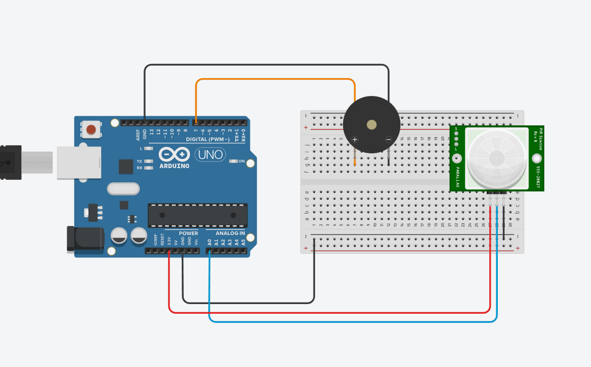

"# arduinoAlarme" 
<h1>Projet Arduino Alarme</h1>

Le projet a été réalisé par Thomas, Hugo, Quentin et Brévin. C'est un système composé d'une carte Rasberry PI Pico, un capteur de mouvement infrarouge et d'un buzzer. Quand le capteur de mouvement est activé il envoie une alerte sur le serveur NodeJs que nous avons configuré. L'utilisateur reçoit ensuite l'alerte qu'il y a une intrusion chez lui. Au même moment une alarme sonore se déclenche par intermittence

<h2>Schéma du système</h2>

<h2> Important </h2>

Lien vers la vidéo de démonstration : https://youtube.com/shorts/EvS6086Ob_k?feature=share

Le projet a été rendu le 3 Février à 13h, ce qui correspond à la date de rendu fixé de base. Nous avions un plus gros projet que nous avons avorté pour être dans les temps de rendu. 
